# 基于 YOLOv8 的密集货架商品检测微调与性能验证报告

## 基本信息

| 项目 | 内容 |
| --- | --- |
| 课程任务 | 图像处理与识别大作业 |
| 团队成员 | 刘易函、卓识、陈奕莱、皇甫泊宁 |
| 数据集 | SKU-110K |
| 个人基础模型 | YOLOv8n |
| 个人实验方向 | 数据增强设置与输入尺寸、batch size 对比 |

## 摘要

本项目面向 SKU-110K 密集货架商品检测场景，使用 Ultralytics YOLOv8 进行迁移学习和性能验证。个人实验以 YOLOv8n 为基础模型，关闭 Mosaic 增强，通过改变输入尺寸和 batch size 完成三次微调。结果表明，提高输入尺寸至 800 后，Recall、mAP@0.5 和 mAP@0.5:0.95 均高于另外两次实验；将 batch size 从 32 降至 16 对最终指标影响较小。四组最终结果中，个人 `finetune2` 的 mAP@0.5:0.95 最高，但部分对照组缺少完整参数与日志，因此组间结论以描述性比较为主。

关键词：YOLOv8；目标检测；SKU-110K；迁移学习；密集小目标；消融实验

## 项目目标

本项目需要完成以下工作：

- 选择非 COCO 检测数据集和 YOLOv8 模型变体。
- 按 Ultralytics 格式准备数据并记录训练参数。
- 完成模型微调，保存日志、权重和可视化结果。
- 比较不同实验在逐 epoch 训练过程中的损失和检测指标。
- 比较微调前后或不同微调方案的 Precision、Recall、mAP@0.5 和 mAP@0.5:0.95。
- 每位成员使用额外 5 张非同源图片进行独立验证。

## 数据集与任务

SKU-110K 是面向超市货架场景的密集目标检测数据集，图像中商品数量多、目标尺度小、遮挡和相互邻接现象明显。项目将所有商品视为同一检测类别，重点考察模型定位密集实例的能力。根据项目现有记录，数据集包含 8,219 张训练图片、588 张验证图片和 2,936 张测试图片。

选择该数据集的原因如下：

- 数据集不是 COCO，符合课程要求。
- 场景具有明显的密集小目标特征，适合验证输入分辨率和数据增强策略。
- 单类别检测减少了类别语义差异的干扰，更适合分析边界框定位能力。

训练环境通过 `SKU-110K.yaml` 指定 `train`、`val` 和 `test` 三个划分，并将类别映射为单一 `object` 类；图片和标签按 Ultralytics YOLO 检测格式一一对应，每个标签行包含归一化后的 `class_id x_center y_center width height`。由于数据集体积较大，当前仓库未归档数据本体和 `SKU-110K.yaml`，复现实验时需要在原训练环境恢复该配置文件及其指向的数据路径。

## 模型与方法

个人实验使用 `yolov8n.pt` 作为预训练权重。YOLOv8n 参数量和计算量较小，在 vGPU 32GB 环境中进行多次微调训练。三次实验均训练 100 个 epoch，采用相同数据集、随机种子和主要优化参数，并关闭 Mosaic 增强。

训练过程记录以下指标：

- 训练损失：Box Loss、Classification Loss、Distribution Focal Loss。
- 验证损失：Box Loss、Classification Loss、Distribution Focal Loss。
- 检测指标：Precision、Recall、mAP@0.5、mAP@0.5:0.95。
- 辅助指标：学习率和累计训练时间。

Precision 用于衡量模型给出的检测框中正确检测所占比例，Recall 用于衡量真实目标中被成功检出的比例。mAP@0.5 使用 IoU=0.5 的匹配阈值，mAP@0.5:0.95 对多个更严格的 IoU 阈值求平均，因此更能反映边界框定位质量。本报告以 mAP@0.5:0.95 作为选择最佳 epoch 的主指标。

## 实验环境

| 项目 | 配置 |
| --- | --- |
| 个人训练环境 | Windows Subsystem for Linux 2，vGPU 32GB |
| 个人训练软件 | Python 3.8+、PyTorch、Ultralytics YOLOv8；历史日志未归档精确版本 |
| Baseline 测试环境 | Windows，Python 3.10.20，PyTorch 2.12.0+cu126，Ultralytics 8.4.51 |
| Baseline 测试 GPU | NVIDIA GeForce RTX 4060 Laptop GPU，8188 MiB |
| 数据处理 | Pandas、NumPy |
| 可视化 | Matplotlib |

项目通过 `config.py` 管理训练参数，`train.py` 启动微调，`test_model.py` 执行验证集或测试集评估，`test_extra_images.py` 完成外部图片推理，`analyze_experiments.py` 统一处理多组逐 epoch 日志。个人历史训练未保存 `pip freeze`、CUDA 和驱动版本，因此报告不虚构精确版本；复现实验时应额外保存 `python --version`、`pip show torch ultralytics` 和 `nvidia-smi` 输出。

## 数据与结果文件位置

为便于复核、复现和课程提交，项目的重要数据与结果按用途保存在以下目录中：

| 路径 | 主要内容 | 报告用途 |
| --- | --- | --- |
| `docs/finetune_results/finetune1/` | 第一次个人微调的 `args.yaml`、`results.csv` 和 `results.png` | 核对 `imgsz=640`、`batch=32`、关闭 Mosaic 的参数及逐 epoch 验证指标 |
| `docs/finetune_results/finetune2/` | 第二次个人微调的参数、逐 epoch 日志和训练曲线 | 核对最终个人方案 `imgsz=800`、`batch=32` 的训练过程 |
| `docs/finetune_results/finetune3/` | 第三次个人微调的参数、逐 epoch 日志和训练曲线 | 核对 `batch=16` 实验及其收敛情况 |
| `docs/finetune_results/baseline/` | Baseline 的 `args.yaml` 和 `results.csv` | 核对 Baseline 训练参数和 30 轮验证集记录 |
| `docs/analysis/personal/` | 指标曲线、损失曲线、学习率曲线及汇总 CSV | 支撑个人三次微调的趋势分析和最终指标比较 |
| `results/test_comparison/` | 微调前后测试集指标 JSON | 支撑独立测试集上的 Precision、Recall 和 mAP 比较 |
| `weights/` | 最终模型权重 `best.pt` | 测试集评估和额外图片推理使用的个人最佳模型 |
| `test_images/` | 5 张额外测试原图 | 个人额外验证的数据来源 |
| `test_images/results/pretrained/` | 预训练 YOLOv8n 对 5 张图片的可视化结果 | 与微调后模型进行定性对比 |
| `test_images/results/finetuned/` | 微调后模型对 5 张图片的可视化结果 | 分析密集商品检测、漏检和重叠框现象 |

其中，`docs/finetune_results/*/results.csv` 记录的是训练过程中每个 epoch 的**验证集**指标，不能作为独立测试集结果；微调前后在 SKU-110K `test` 划分上的最终指标以 `results/test_comparison/comparison_test.json` 为准。`docs/analysis/personal/` 中的文件由训练日志派生生成，原始证据仍是各实验目录中的 `args.yaml` 和 `results.csv`。

## 个人实验设计

| 实验 | 模型 | 输入尺寸 | Batch | Mosaic | Epoch |
| --- | --- | ---: | ---: | ---: | ---: |
| `finetune1` | YOLOv8n | 640 | 32 | 0.0 | 100 |
| `finetune2` | YOLOv8n | 800 | 32 | 0.0 | 100 |
| `finetune3` | YOLOv8n | 640 | 16 | 0.0 | 100 |

`finetune1` 是个人实验基线；`finetune2` 仅提高输入尺寸，用于观察更高空间分辨率对密集小目标检测的影响；`finetune3` 仅降低 batch size，用于观察梯度估计规模变化对收敛和泛化的影响。

三次实验的完整参数保存在 `docs/finetune_results/*/args.yaml`。共同关键参数为：`optimizer=auto`、`seed=0`、`deterministic=true`、`lr0=0.01`、`lrf=0.01`、`weight_decay=0.0005`、`warmup_epochs=3`、`patience=50`、`amp=true`、`mixup=0.0` 和 `copy_paste=0.0`。`weights/best.pt` 的检查点元数据包含运行名 `homeobjects_n_no_mosaic-2`，与 `finetune2` 的 `args.yaml` 一致。

### 微调流程与模型选择

1. 使用 `yolov8n.pt` 初始化检测模型，并通过 `SKU-110K.yaml` 加载单类别 SKU-110K 数据。
2. 按三组配置分别训练 100 个 epoch，每个 epoch 在验证集上记录损失、Precision、Recall 和两项 mAP。
3. 保存 `args.yaml`、`results.csv`、`results.png` 以及 `best.pt`、`last.pt` 等权重；本仓库归档了报告直接使用的参数、CSV 和曲线图。
4. 以验证集 mAP@0.5:0.95 选择最佳 epoch。三组最佳 epoch 分别为 75、85 和 90，其中 `finetune2` 在 epoch 85 获得最高值 0.55951。
5. 将 `finetune2` 的最佳权重集中保存为 `weights/best.pt`，再与原始 `yolov8n.pt` 在同一测试集和同一评估参数下比较。

## 验证集最终指标

以下数值来自 `docs/finetune_results/finetune1/`、`finetune2/` 和 `finetune3/` 中 `results.csv` 的第 100 个 epoch 验证集记录，不等同于独立测试集结果。

| 实验 | Precision | Recall | mAP@0.5 | 最终 mAP@0.5:0.95 | 最佳 Epoch | 最佳 mAP@0.5:0.95 | 训练时间 |
| --- | ---: | ---: | ---: | ---: | ---: | ---: | ---: |
| `finetune1` | 0.90961 | 0.83550 | 0.88337 | 0.53988 | 75 | 0.54243 | 97.59 分钟 |
| `finetune2` | 0.91051 | 0.85209 | 0.89545 | 0.55846 | 85 | 0.55951 | 120.78 分钟 |
| `finetune3` | 0.90861 | 0.83649 | 0.88425 | 0.54186 | 90 | 0.54324 | 125.11 分钟 |

与 `finetune1` 相比，`finetune2` 的 Recall 提高 0.01659，mAP@0.5 提高 0.01208，mAP@0.5:0.95 提高 0.01858。其训练时间增加约 23.8%，说明更高输入分辨率带来了更好的检测效果，同时增加了计算开销。

`finetune3` 与 `finetune1` 的最终指标非常接近。mAP@0.5:0.95 仅提高 0.00198，但训练时间更长，因此当前单次实验不足以证明较小 batch size 具有实际优势。

## 逐 Epoch 变化分析

完整图表由 `analyze_experiments.py` 生成，报告重点观察以下现象：

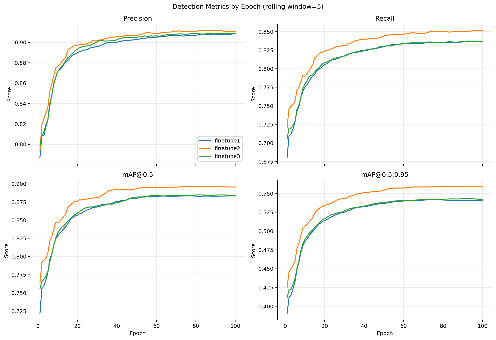

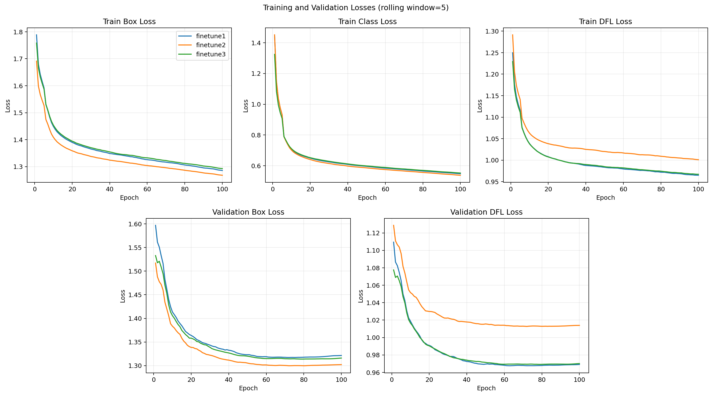

- 三组实验在训练前期检测指标快速提升，后期进入缓慢收敛区间。
- `finetune2` 从早期开始就在 Recall 和两项 mAP 上保持较高水平，最终优势不是仅由最后一个 epoch 的随机波动造成。
- `finetune1` 与 `finetune3` 的曲线和最终指标接近，需要结合末段标准差判断稳定性，不能只依据单点值排序。
- 学习率经历预热和后续衰减，检测指标的主要提升集中在训练前中期。

三组实验首次达到各自最佳 mAP@0.5:0.95 的 95% 时，分别位于 epoch 19、15 和 18。`finetune2` 更早进入有效收敛区间。按 mAP@0.5:0.95 选择的最佳 epoch 分别为 75、85 和 90，对应最佳值为 0.54243、0.55951 和 0.54324。

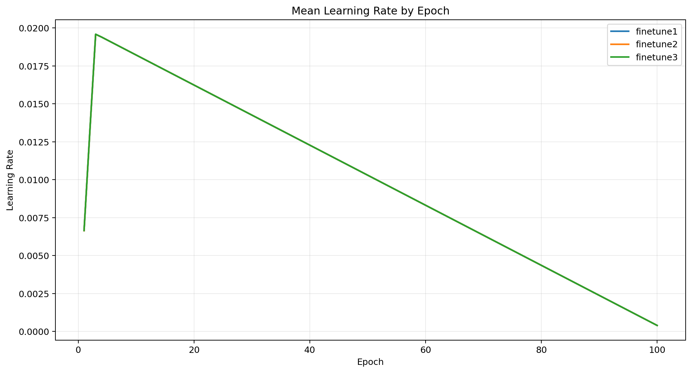

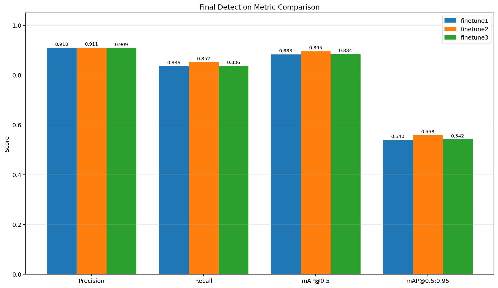

数据质量检查发现，`finetune1` 和 `finetune2` 的 `val/cls_loss` 为非有限值 `inf`。因此这两组实验不能依据验证分类损失讨论泛化趋势。SKU-110K 为单类别检测任务，但正常情况下该字段仍应为有限数值；报告仅使用其余有效损失和检测指标，并保留该异常作为训练日志复核事项。

## 个人实验结论

在当前数据、模型和单次训练条件下，`finetune2` 是三次微调中综合性能最好的方案。提高输入尺寸能保留更多小目标细节，对密集货架商品定位更有利，主要体现为漏检减少和严格 IoU 条件下的定位质量提高。

输入尺寸提升同时增加训练耗时，最终部署时需要在检测精度、推理速度和显存占用之间权衡。batch size 从 32 降至 16 没有形成明显性能优势，且本次训练耗时更长。由于每种配置仅运行一次，结论应表述为当前实验观察，而不是普遍规律。

从末 10 个 epoch 的 mAP@0.5:0.95 标准差看，`finetune1`、`finetune2` 和 `finetune3` 分别约为 0.000196、0.000128 和 0.000497。`finetune2` 后期最稳定，`finetune3` 波动相对更明显，但三组绝对波动均较小。

## 微调前后测试集性能比较

课程要求的最终比较必须使用 SKU-110K 的 `test` 划分。评估脚本已支持显式指定 `split=test`，并会把两组指标分别保存为 JSON。为保证公平性，微调前后统一使用 `imgsz=800`、`batch=16` 和同一测试集：

```bash
python test_model.py \
	--pretrained \
	--finetuned \
	--split test \
	--imgsz 800 \
	--batch 16 \
	--output results/test_comparison
```

已在原训练环境完成评估，结果保存于 `results/test_comparison/comparison_test.json`，两组模型均使用 SKU-110K 的 `test` 划分、`imgsz=800`、`batch=16` 和 `device=0`。下表直接采用该文件中的实测结果：

| 模型 | Precision | Recall | mAP@0.5 | mAP@0.5:0.95 |
| --- | ---: | ---: | ---: | ---: |
| 微调前 `yolov8n.pt` | 0.1211 | 0.0025 | 0.0007 | 0.0003 |
| 微调后 `weights/best.pt` | 0.9117 | 0.8632 | 0.9157 | 0.5736 |
| 变化量（微调后 - 微调前） | +0.7906 | +0.8607 | +0.9150 | +0.5732 |

测试结果表明，微调后模型的四项指标均明显提高。其中 Recall 从 0.0025 提高到 0.8632，说明模型对密集货架商品的检出能力得到显著改善；mAP@0.5:0.95 从 0.0003 提高到 0.5736，表明微调不仅增加了检出数量，也明显改善了不同 IoU 阈值下的综合定位性能。

微调训练使用 `batch=32`，测试时使用 `batch=16`。评估 batch 主要影响显存占用和吞吐速度，不改变模型权重；微调前后模型在本次比较中使用相同的评估 batch，因此比较口径一致。测试使用的是 epoch 85 对应的 `best.pt`，而上一节“最终指标”同时保留了第 100 个 epoch 数值，两种口径不能混为一谈。

需要注意，`yolov8n.pt` 的输出类别是 COCO 80 类，而 SKU-110K 使用单一 `object` 类，二者标签语义并不完全一致。微调前结果可用于展示迁移学习起点，但不能把差异全部归因于特征提取能力提升。

## 四组对照试验

### 实验设置

团队采用四组平行实验，分别考察基线配置、模型容量、数据增强和优化器策略。各组设置如下：

| 实验组 | 基础模型 | 主要设置 | 实验目的 |
| --- | --- | --- | --- |
| Baseline 调优组 | YOLOv8n | 归档参数为 `imgsz=640`、`batch=8` | 提供已调参基线 |
| 模型容量对比组 | YOLOv8s | `imgsz=640`、`batch=8` | 考察增大模型容量的影响 |
| 数据增强方案组（个人） | YOLOv8n | `imgsz=800`、`batch=32`、`mosaic=0.0`、100 epoch | 比较关闭 Mosaic 后的个人最佳方案 |
| 优化策略调优组 | YOLOv8n | 成员说明为使用 AdamW 优化器 | 考察优化器变化的影响 |

个人方案使用 `finetune2` 的 `weights/best.pt`。需要说明的是，四组在模型、输入尺寸、batch、训练轮数和优化器等方面并未全部统一；个人方案除关闭 Mosaic 外，还将输入尺寸设置为 800。因此四组结果只能进行最终方案级比较，不能把组间全部差异单独归因于 Mosaic、模型容量或优化器。

### 最终性能汇总

| 实验组 | Precision | Recall | mAP@0.5 | mAP@0.5:0.95 | 数据来源 |
| --- | ---: | ---: | ---: | ---: | --- |
| Baseline 调优组 | 0.8960 | 0.8250 | 0.8866 | 0.5360 | 成员提供的测试终端输出 |
| 模型容量对比组 | 0.9110 | 0.8500 | 0.8940 | 0.5590 | 成员提供的最终指标，原始日志未归档 |
| 优化策略调优组 | 0.9110 | 0.8500 | 0.8940 | 0.5590 | 成员提供的最终指标，原始日志未归档 |
| 数据增强方案组 `finetune2` | **0.9117** | **0.8632** | **0.9157** | **0.5736** | `results/test_comparison/comparison_test.json` |

### 结果分析

**总体表现。** 以更严格、综合性更强的 mAP@0.5:0.95 作为主要排序指标，个人数据增强方案组排名第一，模型容量对比组与优化策略调优组并列第二，Baseline 调优组排名第四。个人 `finetune2` 的四项指标均为最高，说明该配置在当前已提供结果中具有最好的综合检测表现。

**与 Baseline 比较。** `finetune2` 的 Precision、Recall、mAP@0.5 和 mAP@0.5:0.95 分别提高 0.0157、0.0382、0.0291 和 0.0376。其中 Recall 的提升大于 Precision，表明该方案的主要收益体现在减少密集商品漏检；mAP@0.5:0.95 的提升也说明更严格 IoU 条件下的边界框定位质量有所改善。

**与模型容量组和优化策略组比较。** 两个对照组当前提供的四项结果完全相同。`finetune2` 相比它们的 Precision、Recall、mAP@0.5 和 mAP@0.5:0.95 分别高 0.0007、0.0132、0.0217 和 0.0146。三组 Precision 基本相当，但 `finetune2` 具有更高的 Recall 和 mAP，综合性能略优。

**模型容量结果。** 模型容量组相对 Baseline 的 Precision、Recall、mAP@0.5 和 mAP@0.5:0.95 分别提高 0.0150、0.0250、0.0074 和 0.0230，表明 YOLOv8s 方案在本次测试中的整体性能高于 Baseline。不过，模型容量组与优化策略组的四项指标完全一致，仍应结合两组原始评估输出确认数据是否分别抄录，避免重复使用同一组结果。

### 比较有效性

严格横向比较要求四组使用相同的 SKU-110K `test` 划分以及一致的 `imgsz`、置信度阈值、NMS IoU 阈值和模型选择规则。目前个人 `finetune2` 的结果有 JSON 文件，Baseline 结果有测试终端记录，模型容量组和优化策略组只有人工提供的最终指标。因此本节能够完成结果汇总和描述性比较，但不能作为严格控制变量实验的最终证据。

Baseline 测试时，SKU-110K 原有 2,936 张图片中的 `test_274.jpg` 因文件截断被忽略，最终使用 2,935 张图片和 431,419 个目标实例。其评估环境为 Ultralytics 8.4.51、Python 3.10.20、PyTorch 2.12.0+cu126 和 NVIDIA GeForce RTX 4080 GPU 在 AutoDL平台服务器；模型融合后包含 3,005,843 个参数，计算量为 8.1 GFLOPs，单张图片平均推理时间为 1.9 ms。

## 额外五张图片验证

选择 5 张不属于 SKU-110K 的真实货架图片，使用 `test_extra_images.py` 脚本在统一参数下对预训练模型和微调后模型分别推理。微调后模型使用 `finetune2`（输入尺寸 800，对应报告"个人实验结论"中的最佳方案）的 `weights/best.pt`。

### 测试集说明

| 图片 | 格式 | 场景概述 |
| --- | --- | --- |
| `img1.jpg` | JPEG | 超市谷物货架，标签含西班牙语 `ARROZ`、`frijol` |
| `img2.jpg` | JPEG | 超市冷藏货架，瓶装/盒装饮料密集排列 |
| `img3.png` | PNG | 超市货架 |
| `img4.png` | PNG | 多层食品货架，罐头、调味品、面包混杂 |
| `img5.jpg` | JPEG | 超市过道透视场景，源自网络图（含"我图网"水印） |

5 张图均不来自 SKU-110K 训练/验证/测试集，与训练数据无重叠。

### 推理参数

`test_extra_images.py` 调用的关键参数全部来自 `config.py`：

- 预训练模型：`yolov8n.pt`（COCO 80 类，ultralytics 自动下载）
- 微调后模型：`weights/best.pt`（finetune2）
- 输入尺寸：`config.IMG_SIZE = 640`
- 设备：`config.DEVICE = 0`（CUDA 可用）
- 置信度阈值：`conf=0.25`
- NMS IoU 阈值：`iou=0.7`
- 单图最大检测数：`max_det=300`

### 检测数对比

| 图片 | 预训练检测数（类别） | 微调后检测数 | 微调后置信度区间 | 主要现象 |
| --- | --- | ---: | --- | --- |
| `img1` | 0 | 48 | 0.26 ~ 0.69 | 预训练模型未输出检测框；微调后在 6 层货架区域输出多个框 |
| `img2` | 12（bottle × 11 + clock × 1） | 173 | 0.25 ~ 0.78 | 预训练仅识别部分瓶装；把冷藏柜圆形价格牌误识为 clock（0.27）；微调后输出密集候选框 |
| `img3` | 6（refrigerator × 2 + bottle × 3 + apple × 1） | 135 | 0.25 ~ 0.77 | 预训练只能命中训练 COCO 时见过的常见类；微调后覆盖货架 |
| `img4` | 0 | 300 | 0.55 ~ 0.78 | 微调结果达到 `max_det=300` 上限；可视化中存在重叠框，底层部分包装未被覆盖 |
| `img5` | 0 | 144 | 0.25 ~ 0.72 | 含水印的跨来源图片上仍有大量模型响应，准确性需人工标注验证 |
| **总计** | **18** | **800** | — | 微调后输出框更多，但检测数不等同于准确率 |

### 案例分析

**预训练模型的失效模式。** 预训练 YOLOv8n 在 COCO 80 类上预训练，对货架密集商品缺少与 SKU-110K 单类标注相匹配的输出语义。img1、img4、img5 未输出检测框；img2、img3 仅命中若干 `bottle`、`refrigerator`、`apple` 等常见类，且置信度普遍偏低（最高 0.60）。img2 中一处冷藏柜圆形价格牌被误判为 `clock`（0.27），属于外观相似导致的误检。由于额外图片没有人工标注，此处只能统计零检测，不能称为零召回。

**微调后模型的候选框分布。** 微调后模型在 5 张外部图上输出了更多候选框，其中 img2 为 173 框、img4 为 300 框、img5 为 144 框。由于这些图片没有人工标注，不能仅凭检测框数量判定性能提升，也不能严格计算过检和漏检。img4 已达到 `max_det=300` 上限，实际候选框可能更多。可视化中，中上层罐头和瓶装区域存在重叠框与“框中框”，可能说明极密集场景下 NMS 抑制不足；底层部分包装未被框覆盖，可能与训练分布、域差异、遮挡或推理尺度有关。

**跨域表现。** img5 是带水印的网络图，与训练集来源不同，模型仍输出 144 个框，说明模型对该场景产生了较强响应。由于没有 ground truth，不能据此直接断言具有良好的跨域召回率或鲁棒性。

**训练分辨率与推理分辨率的差距。** 训练 finetune2 时输入尺寸为 800，本次推理使用 `config.IMG_SIZE = 640`，模型在推理时把图 letterbox 到 640，可能损失一部分小目标细节。这一设置未在脚本层做参数切换，限制了对"高分辨率优势"的更严格验证。

### 可视化对比

每张图按"预训练 → 微调后"两行排列：

| 图片 | 预训练 | 微调后 |
| --- | --- | --- |
| `img1` 谷物货架 |  |  |
| `img2` 冷藏货架 | 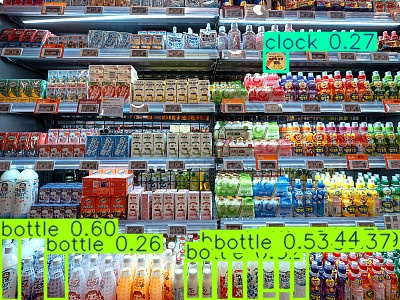 | 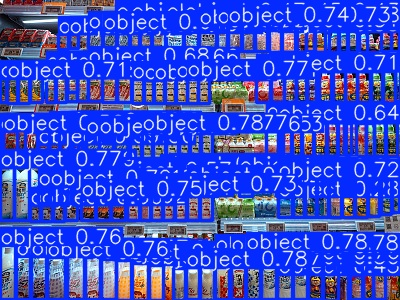 |
| `img3` 超市货架 | 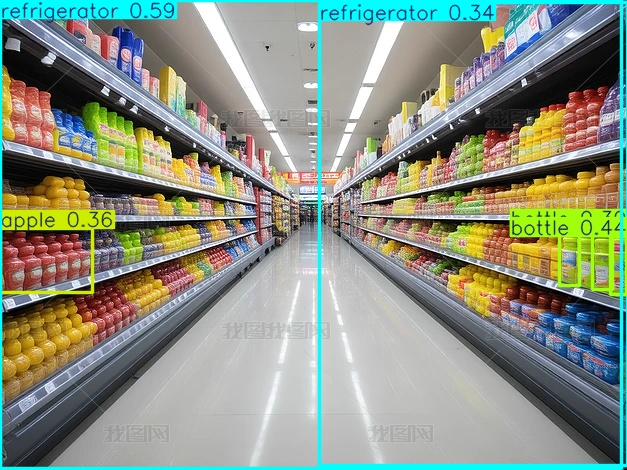 | 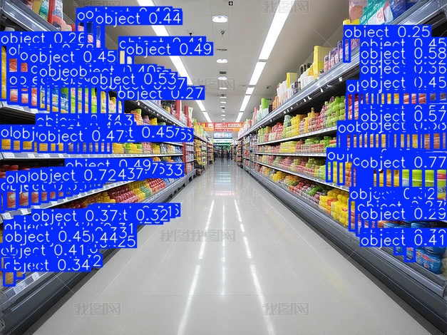 |
| `img4` 多层食品 | 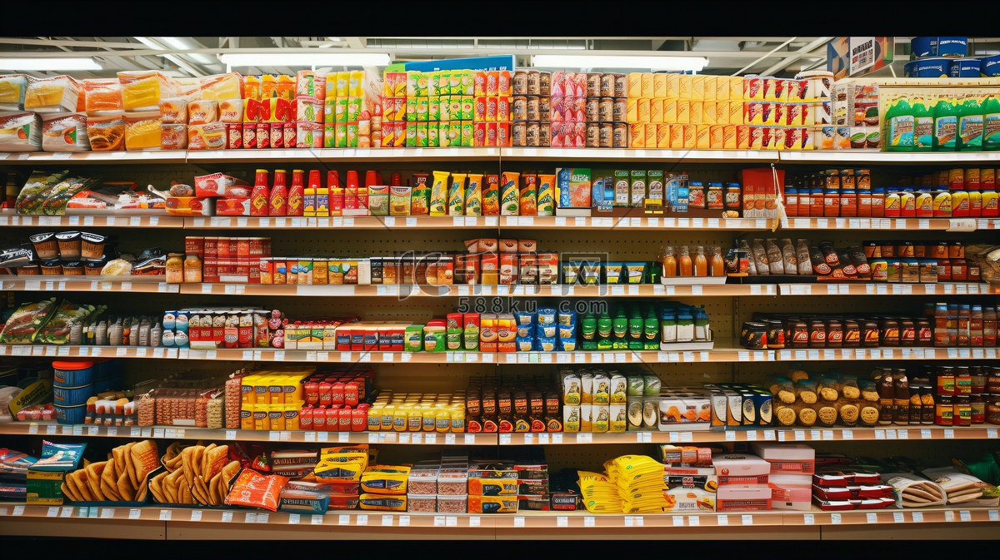 | 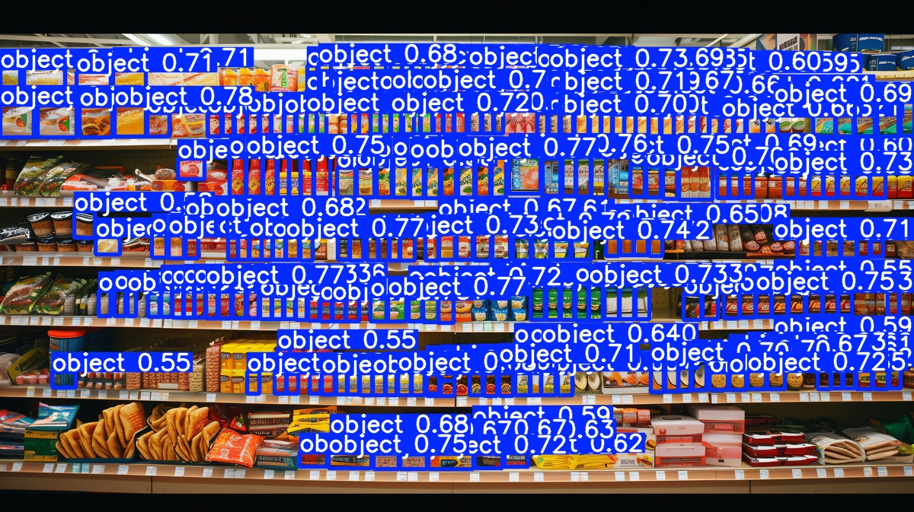 |
| `img5` 超市过道 | 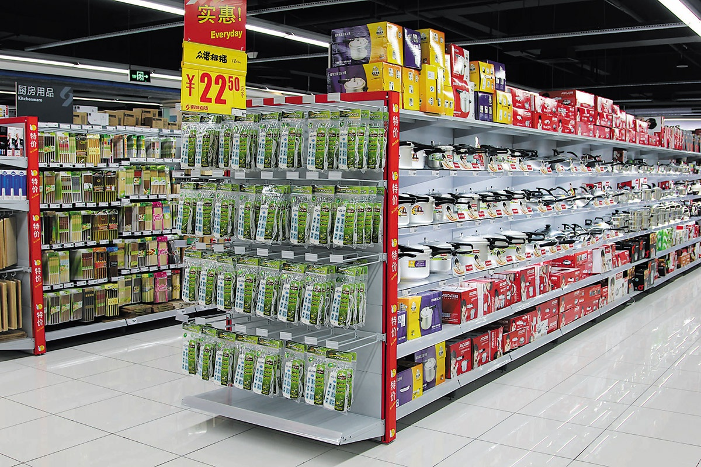 | 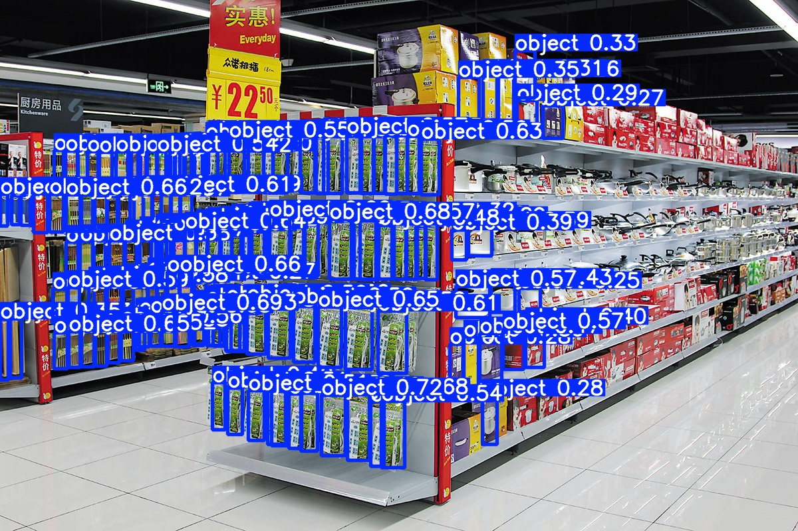 |

可视化产物位于 `test_images/results/{pretrained,finetuned}/` 下，与本节中的图片相对路径一一对应。

当前仓库保存了 5 张原图和两组可视化图片，但历史运行没有归档 `test_extra_images.py` 现版本可生成的 `pretrained_summary.json` 与 `finetuned_summary.json`。报告中的检测数和置信度区间来自已有运行记录；若需完全机器可复核，应在原环境重新运行脚本并保存 JSON 汇总。

## 局限性

- 每种个人配置仅训练一次，尚未通过多随机种子实验估计方差。
- 已完成微调前后模型在 SKU-110K 测试集上的统一评估，但当前只进行了一次测试，尚未通过不同随机种子或重复实验评估结果波动。
- 四组对照的训练轮数、输入尺寸和 batch 等设置未完全统一；模型容量组和优化策略组的四项结果完全相同，且缺少原始日志，限制了严格的控制变量分析。
- 两组实验的验证分类损失存在 `inf`，需要检查 Ultralytics 版本、标签缓存和损失记录过程。
- 只有 Baseline 保存了推理速度、参数量和 FLOPs，其他组缺少同口径的效率数据，无法完整比较部署成本。
- 额外 5 张图片的对比只统计检测数与置信度分布，且预训练 COCO 模型和微调单类别模型的标签语义不同。未做人工 ground truth 标注，因此不能给出可靠的 Precision、Recall 或“提升倍数”。
- 5 张图推理使用 `config.IMG_SIZE = 640`，未与训练时 finetune2 的 800 输入保持一致，限制了对"高分辨率优势"在外部图上的直接验证。
- 当前仓库未包含 SKU-110K 数据本体和 `SKU-110K.yaml`，跨环境复现前需要恢复数据路径配置。

## 总结

本项目已经完成 YOLOv8n 在 SKU-110K 上的三次微调、训练日志归档、微调前后测试集性能比较和个人 5 张外部图片分析。验证集结果中，`finetune2` 获得最高的 Recall 和 mAP，支持提高输入分辨率有利于当前密集小目标任务的实验观察。测试集上，微调后模型取得 0.9117 Precision、0.8632 Recall、0.9157 mAP@0.5 和 0.5736 mAP@0.5:0.95；在四组最终结果中也排名第一。由于组间训练设置未完全统一、两个对照组结果完全相同且部分原始日志缺失，四组比较目前用于说明方案级表现，不能作为单一变量效果的最终因果结论。

## 参考资料

1. Eran Goldman 等，*Precise Detection in Densely Packed Scenes*，CVPR 2019，SKU-110K 数据集论文：https://openaccess.thecvf.com/content_CVPR_2019/papers/Goldman_Precise_Detection_in_Densely_Packed_Scenes_CVPR_2019_paper.pdf
2. Ultralytics，*Model Training with Ultralytics YOLO*：https://docs.ultralytics.com/modes/train/
3. Ultralytics，*Model Validation with Ultralytics YOLO*：https://docs.ultralytics.com/modes/val/
